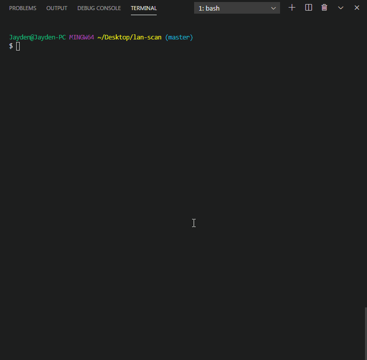

# lan-scan
Scan for devices in a local area network

## Overview
The scanner simply attempts to connect to a range of IP addresses on a range of ports and returns any successful connections in the following form:
```
{
  "192.168.X.XXX": [list of ports where connection was made]
  .
  .
  .
}
```

## Why?
I needed a way to scan for devices on an Android phone that was running a Node.js server via Termux. The packages I found didn't support Android devices so I decided to create a really implementation. 

## Demo


## Bugs & Issues 
- First scan returns an empty array.
- Not running asynchronously or with callbacks, so too large of a search size result in a Heap Error, or Call Stack Error.
- Hostname & MAC address is not yet implemented.


